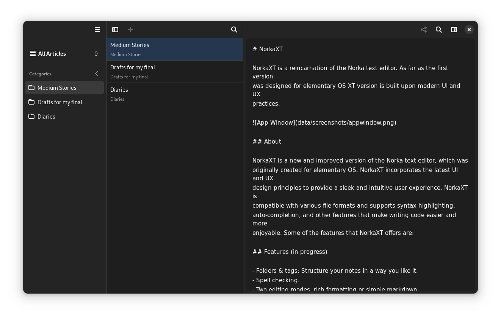

# NorkaXT

NorkaXT is a reincarnation of the Norka text editor. As far as the first version
was designed for elementary OS XT version is built upon modern UI and UX 
practices.

## About

NorkaXT is a new and improved version of the Norka text editor, which was 
originally created for elementary OS. NorkaXT incorporates the latest UI and UX
design principles to provide a sleek and intuitive user experience. NorkaXT is 
compatible with various file formats and supports syntax highlighting, 
auto-completion, and other features that make writing code easier and more 
enjoyable. Some of the features that NorkaXT offers are:

## Features (in progress)

- Folders & tags: Structure your notes in a way you like it.
- Spell checking.
- Two editing modes: rich formatting or simple markdown.
- Dark mode: Switch between light and dark themes to suit your preference and reduce eye strain.
- Search and replace: Find and replace text across multiple files with regular expressions and case sensitivity options.
- Keyboard shortcuts: Access common commands and functions with customizable keyboard shortcuts.
- Plugins: Extend the functionality of NorkaXT with plugins that add new features or integrate with external tools.
- AI integration?!