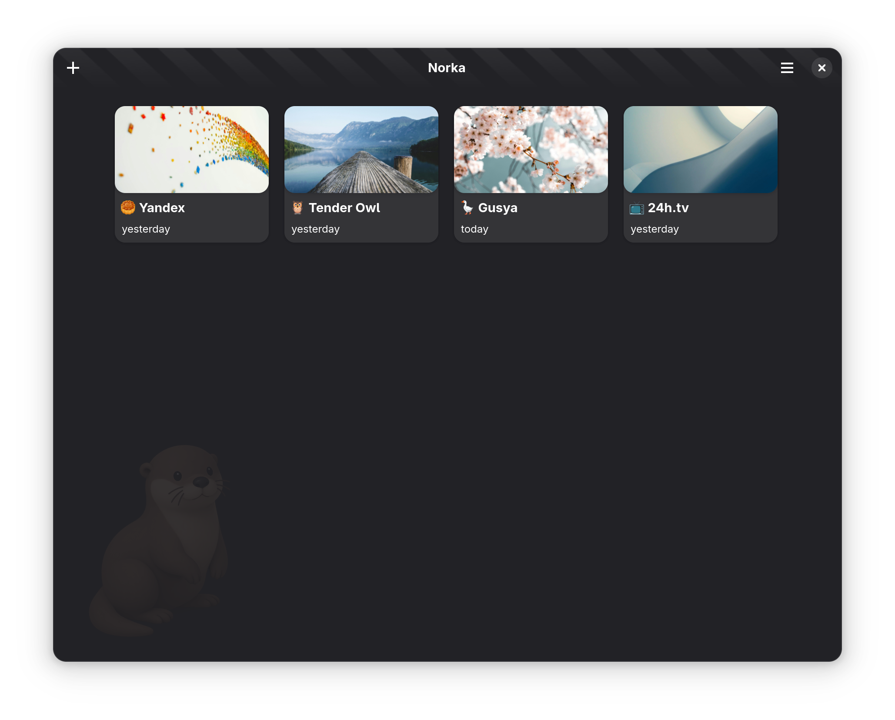

# NorkaXT

[](https://opensource.org/licenses/MIT)

NorkaXT is a modern, feature-rich note-taking application built with Python and GTK. It provides a clean, distraction-free writing environment with powerful organization features.



## 🌟 Features

- **Workspace Management**: Organize your notes into different workspaces
- **Rich Text Editing**: Built-in editor with syntax highlighting
- **Markdown Support**: Write and preview markdown content
- **Responsive Interface**: Clean, modern UI that adapts to your workflow
- **Auto-save**: Your work is automatically saved as you type
- **Search Functionality**: Quickly find your notes with powerful search

## 🚀 Installation

### Prerequisites

- Python 3.8 or higher
- GTK 4.0 or higher
- Python GObject introspection

### Linux (Debian/Ubuntu)

1. Get the latest version of NorkaXT
   ```bash
   # Clone the repository
   git clone https://github.com/tenderowl/norkaxt.git
   cd norkaxt
   ```

2. Open in GNOME Builder

3. Run the application

### Other Platforms

For other platforms, please ensure you have the required GTK4 libraries installed before proceeding with the Python package installation.

## 🛠️ Development

### Setting Up Development Environment

1. Clone the repository:
   ```bash
   git clone https://github.com/tenderowl/norkaxt.git
   cd norkaxt
   ```

2. Create and activate a virtual environment:
   ```bash
   python -m venv venv
   source venv/bin/activate  # On Windows: .\venv\Scripts\activate
   ```

### Project Structure

```
norkaxt/
├── norka/              # Main package
│   ├── models/         # Data models
│   ├── services/       # Business logic
│   ├── widgets/        # UI components
│   ├── __init__.py
│   └── main.py         # Application entry point
├── data/               # Resource files
├── po/                 # Translation files
├── tests/              # Test files
├── README.md           # This file
└── pyproject.toml      # Python package metadata
```

### Running Tests

```bash
pytest
```

## 🤝 Contributing

Contributions are welcome! Please feel free to submit a Pull Request. For major changes, please open an issue first to discuss what you would like to change.

1. Fork the repository
2. Create your feature branch (`git checkout -b feature/AmazingFeature`)
3. Commit your changes (`git commit -m 'Add some AmazingFeature'`)
4. Push to the branch (`git push origin feature/AmazingFeature`)
5. Open a Pull Request

## 📄 License

This project is licensed under the MIT License - see the [LICENSE](LICENSE) file for details.

## 🙏 Acknowledgments

- Built with ❤️ and Python
- Thanks to all contributors who have helped shape this project
